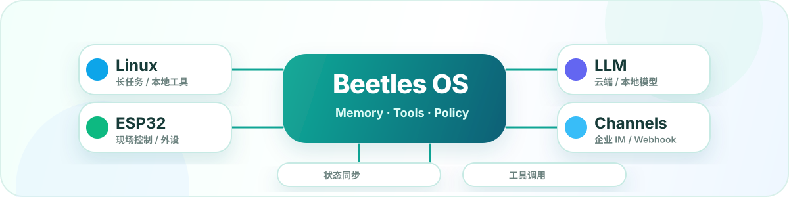
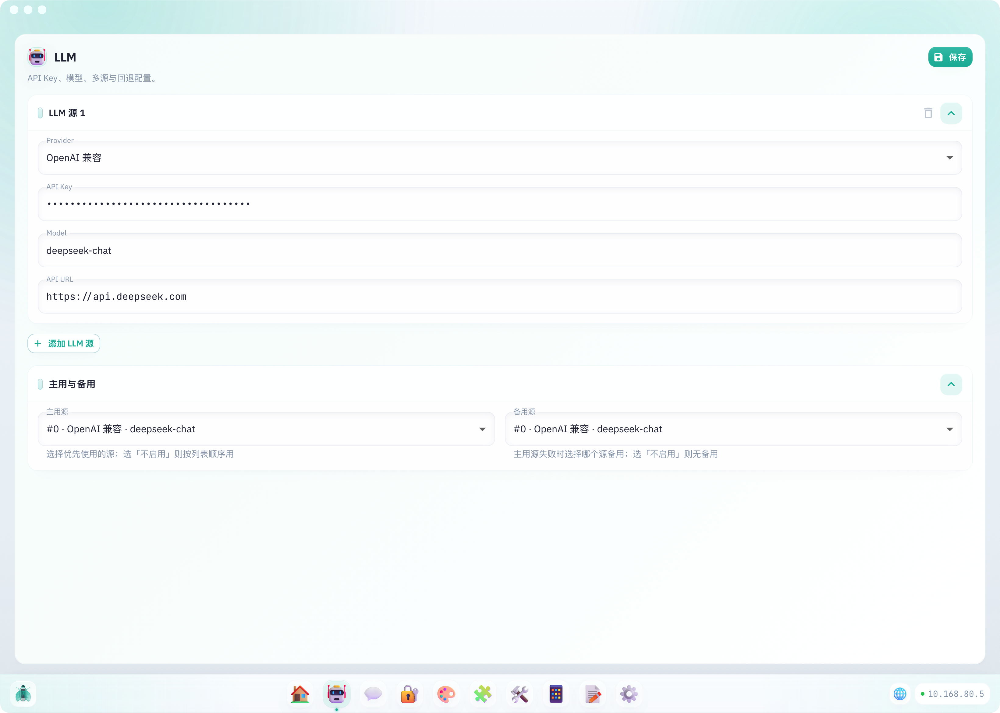
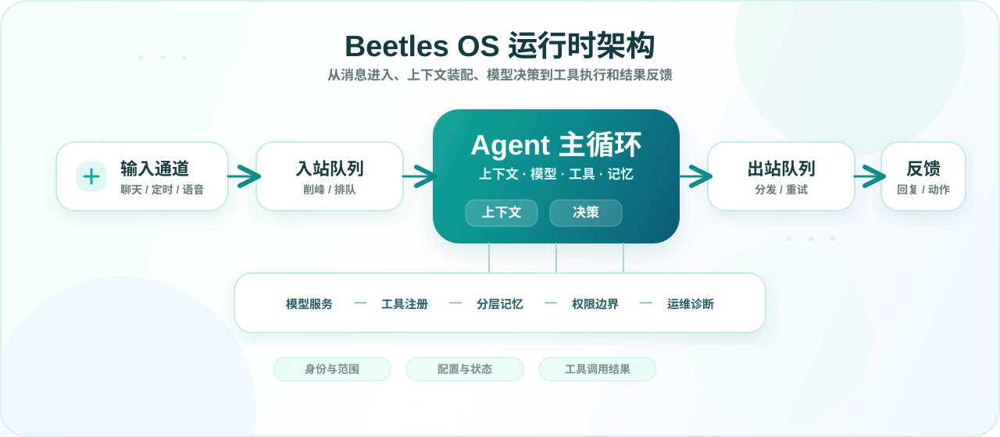
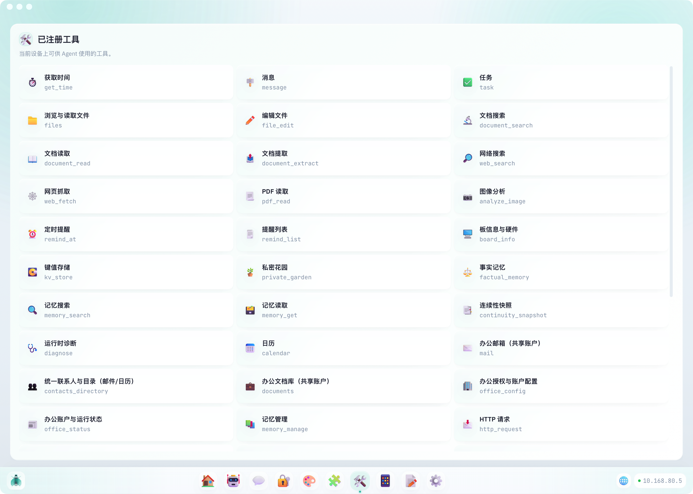
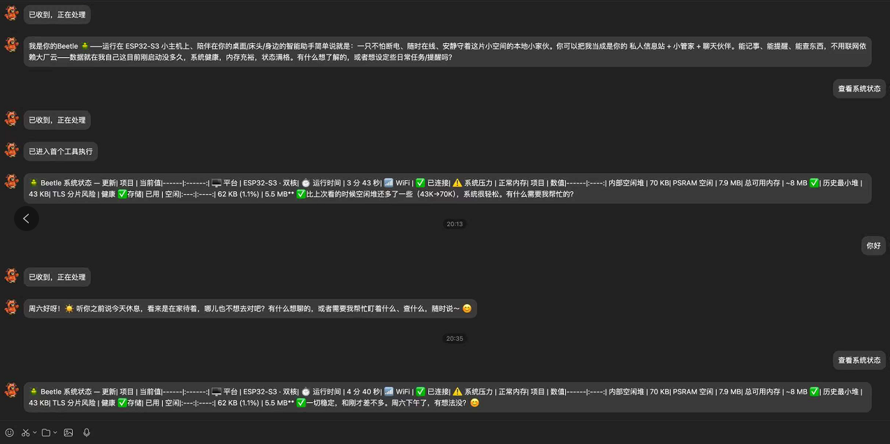
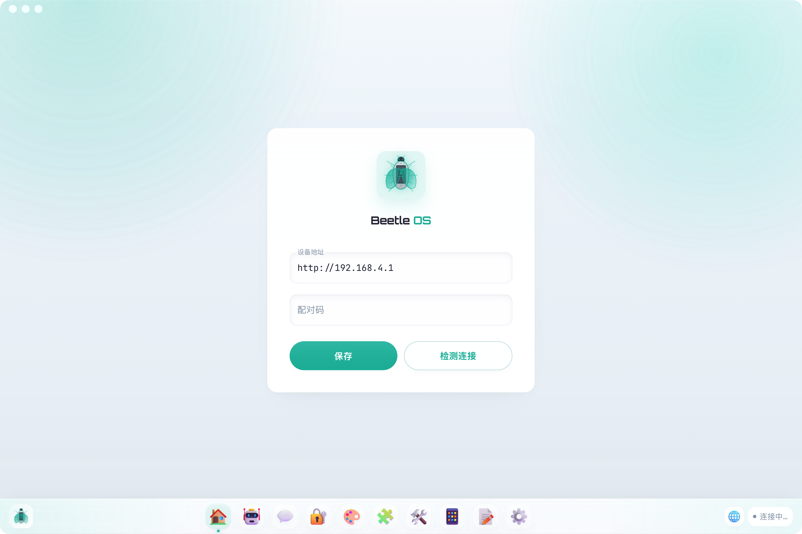
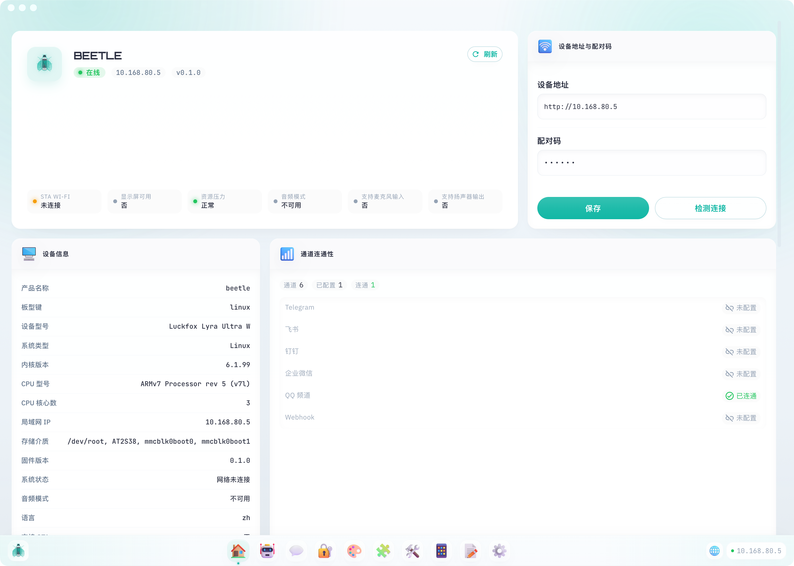
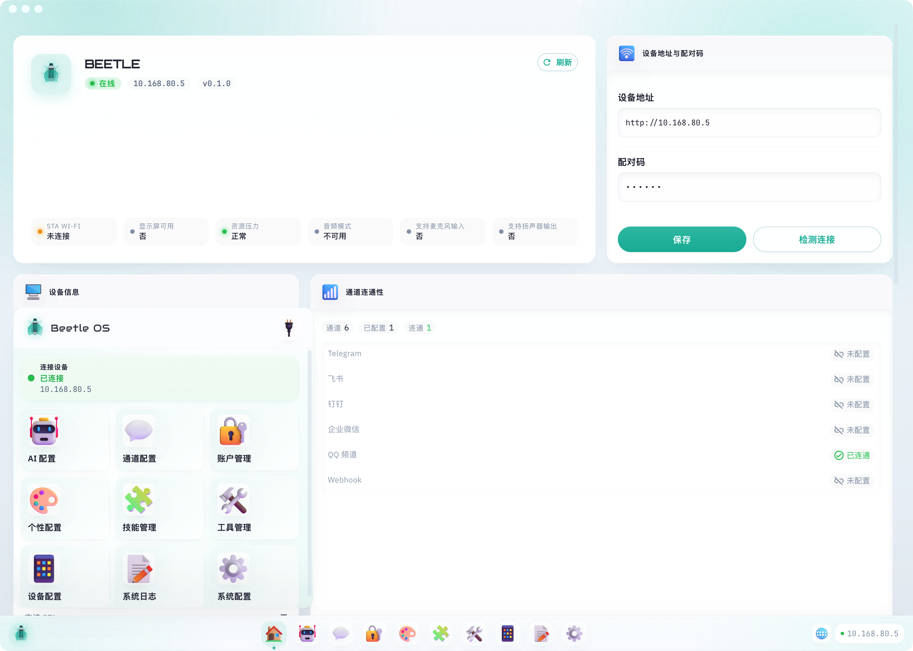

<div align="center">
  <a href="https://github.com/Openbeetles/beetles">
    
  </a>

  <h3><strong>智能硬件设备系统 · 多通道接入 · 模型服务 · 工具执行 · 记忆连续性 · 硬件控制 · 运维诊断</strong></h3>

  <p>
    <a href="https://github.com/Openbeetles/beetles"></a>
    <a href="LICENSE-MIT"></a>
  </p>

  <p>
    <a href="https://github.com/Openbeetles/beetles">主页</a> |
    <a href="docs/README.md">文档</a> |
    <a href="#quick-start">快速开始</a> |
    <a href="#build-from-source">从源码构建</a> |
    <a href="README.md">English</a>
  </p>
</div>

<p align="center">
  
</p>

**Beetles OS** 是面向 ESP32 与 Linux 边缘设备的智能硬件设备系统。它把消息入口、大语言模型接入、工具调用、硬件能力、记忆连续性和运维诊断整合到同一套设备侧系统中，使设备能够从自然语言目标进入可配置、可追踪、可恢复的执行流程。

对使用者来说，Beetles OS 提供的是一个设备智能层：用户可以通过聊天通道、语音或本地界面提出目标；系统结合配置、记忆、现场状态和资源压力，向模型提供受控上下文与工具边界，再由 Beetles OS 完成具体执行并返回结果。

当前主线支持 **ESP32-S3**、**ESP32-P4-NANO** 和 **Linux**。更多终端形态需要按平台抽象与硬件能力另行适配，不在当前公开可用范围内。

> 代码包名、命令、默认热点和部分路径目前仍沿用 `beetle` / `Beetle`；品牌展示统一使用 **Beetles OS**。

## 核心问题

大模型让设备交互从固定指令转向目标表达，但真实设备不能把执行权直接交给模型本身。凭据、文件、引脚、网络连接、系统重启和硬件动作都必须由设备系统统一管理。

Beetles OS 解决的是这些能力落到真实设备后的基本问题：如何接入、如何授权、如何执行、如何记录，失败时如何诊断与恢复。

| 目标 | Beetles OS 的处理方式 |
|------|------------------------|
| 自然语言进入设备现场 | 支持多种消息入口，把用户目标转入设备侧任务流程 |
| 模型参与判断但不越界 | 只向模型提供允许使用的工具、上下文和约束，执行由 Beetles OS 完成 |
| 硬件能力可配置 | 将外设注册为受控能力，按配置、平台和运行压力决定是否开放 |
| 状态和问题看得见 | 展示网络、资源压力、模型调用、工具调用、日志和恢复入口 |
| 长期运行可治理 | 用入站队列、出站队列、健康检查、诊断工具和资源准入保护设备稳定性 |
| 换平台不重做整套系统 | 同一设备系统覆盖 ESP32 与 Linux，按设备资源选择构建形态 |

Beetles OS 不替代 PLC、工控机或原有业务系统。它更适合部署在现有系统旁边，作为对话入口、工具调度层、设备控制层和运维可见性层。

## 适用场景

| 场景 | 典型用途 |
|------|----------|
| 桌面或值班终端 | 聊天、提醒、文档摘要、状态播报、值班提醒 |
| 前台设备 | 访客问答、信息展示、消息转发、运营协助 |
| 设备控制器 | 通过对话触发灯光、电机、蜂鸣器、继电器、传感器等受控动作 |
| 监测节点 | 读取传感器、判断阈值、发送告警 |
| Linux 边缘节点 | 常驻服务、办公集成、长任务、部署回滚和本地工具调用 |
| 自定义智能硬件 | 复用消息入口、模型接入、记忆、工具、配置页和诊断能力 |

## 支持多种通信通道

<p align="center">
  
</p>

当前代码提供 Telegram、飞书、钉钉、企业微信、QQ 频道和 WebSocket 通道面；实际可选项由当前固件或 Linux 包编译进来的 feature 决定。

默认 host/developer 构建包含 Telegram、飞书、企业微信和 QQ 频道；`linux-full` 包型补入钉钉和 WebSocket；默认 ESP 官方包以设备资源为边界，当前主要带入 QQ 频道和设备侧核心能力。企业内部可以选择飞书、钉钉、企业微信或 QQ 频道；个人和海外场景可以选择 Telegram；WebSocket 适合自定义实时前端。

## 工业场景

工业现场需要可靠、安全、可运维的边缘设备。Beetles OS 适合部署在现有控制系统旁，作为边缘 Agent、交互层、诊断层和工具调用层。

| 需求 / 用例 | 支持方式 |
|-------------|----------|
| 设备告警 | 读取状态、判断异常、生成告警说明，并推送到已配置通道 |
| 现场巡检 | 记录设备状态、巡检结果和历史问题，为后续处理保留上下文 |
| 远程维保 | 运维人员用自然语言查询状态、触发诊断或执行受控恢复动作 |
| 产线辅助 | 将 SOP、任务提醒、异常说明和现场反馈接入同一对话入口 |
| 环境监测 | 接入传感器，处理温湿度、烟雾、水位、能耗等监控和阈值告警 |
| 边缘网关 | 在 Linux 或 ESP 设备上连接本地硬件、模型服务、业务 API 和消息通道 |
| 安全控制 | 仅暴露允许的工具和设备能力，避免模型直接访问引脚、文件和凭据 |

## 记忆能力

Beetles OS 的记忆不是聊天记录的堆积，而是设备理解现场、延续任务和解释行为的依据。它用于保存设备身份、接入设备、现场事件、任务进度、恢复点和可复核证据。

设备重启、切换通道或更换操作人员后，Agent 可以通过记忆恢复关键上下文，但不会把过期状态直接当成当前事实。

| 记忆层 | 保存内容 | 用途 |
|--------|----------|------|
| 会话摘要 | 最近对话、用户目标、未完成事项 | 在长对话中保留上下文，减少原文注入 |
| 长期记忆 | 稳定偏好、项目、任务、约束和事实 | 保存稳定信息，提升现场适配能力 |
| 事实记忆 | 带来源、置信度和新鲜度的关键事实 | 区分确定事实和可能过期的信息 |
| 连续性记忆 | 当前进度、中断原因、下一步动作 | 支持任务中断、设备重启和远程接手后的恢复 |
| 证据归档 | 历史记录、引用、日志和观察结果 | 为解释、审计和排障提供依据 |
| 记忆诊断 | 稀疏、过期、冲突或待修复的记忆状态 | 让运维人员查看并修复记忆问题 |

记忆会按场景分范围：有些只属于当前会话，有些属于用户，有些属于设备或外部世界事实。Beetles OS 会给关键记忆保留来源、时间和复核提示，避免记忆混淆和错误引用。

## 支持大语言模型

Beetles OS 不绑定单一模型厂商。你可以在配置页维护多个模型来源，并设置调用顺序；当前一个来源不可用时，系统会按配置尝试后续来源。

<p align="center">
  
</p>

当前可配置的模型来源包括：

| provider | 说明 |
|----------|------|
| `openai` | OpenAI 默认接口 |
| `openai_compatible` | 第三方 OpenAI-compatible 服务或自定义网关 |
| `gemini` | Google Gemini 兼容接入 |
| `glm` | 智谱 GLM |
| `qwen` | 通义千问 / DashScope 兼容模式 |
| `deepseek` | DeepSeek |
| `moonshot` | Moonshot |
| `ollama` | 本地或局域网 Ollama |
| `anthropic` | Anthropic Claude 接口 |

密钥、服务地址、模型名、自定义请求头、模型类型和回退顺序都可以在本地配置页维护，不需要把某一家服务写死在固件里。`model_kind` 可区分文本、多模态、图像生成和视频生成；视觉相关能力只会使用适配的多模态来源。

<p align="center">
  
</p>

第一次接入时，建议先用一个模型来源、一组密钥和一个模型名跑通完整链路，再增加其他来源并调整顺序。详细字段见 [模型服务配置](docs/zh-cn/llm-providers.md)。

## 运行链路架构

<p align="center">
  
</p>

Beetles OS 不会将消息直接转发给大模型。消息进入系统后进入入站队列，再由 Agent 主循环处理：

```text
聊天通道 / 定时任务 / 语音输入
        -> 入站队列
        -> Agent 主循环
        -> 大模型 + 工具 + 记忆
        -> 出站队列
        -> 聊天回复 / 硬件动作 / 系统任务
```

处理过程中，系统会判断以下信息：

- **来源身份**：通道、会话、用户和允许范围。
- **上下文**：当前配置、会话摘要、稳定事实、历史证据和设备状态。
- **可用工具**：根据平台、功能开关、硬件配置和运行压力动态生成工具列表。
- **保护动作**：配置保存、远端发送、恢复、硬件控制等操作需要明确边界。
- **输出目标**：聊天回复、提醒、任务、硬件动作或系统诊断结果。

因此，Beetles OS 的运行链路包括：**入口、上下文、决策、工具、记忆、执行、反馈、运维**。

## 工具与运维可见性

工具是模型进入真实设备的执行边界。Beetles OS 向模型暴露的是经过注册的工具说明、参数要求和使用约束；实际的配置保存、硬件控制、状态诊断和消息发送由 Beetles OS 完成。

<p align="center">
  
</p>

商用设备不能只关注一次回复是否成功，还需要在长期使用中定位问题。配置页会展示健康状态、资源压力、模型调用、工具调用和日志；聊天通道也可以触发状态查询，让远程运维人员先获得平台、网络、资源压力和历史负载，再决定下一步动作。

<p align="center">
  
</p>

<p align="center">
  
</p>

## 主要能力

| 能力 | 说明 |
|------|------|
| 聊天入口 | 支持 Telegram、飞书、钉钉、企业微信、QQ 频道等入口，实际可用项取决于当前构建包型 |
| 模型接入 | 支持 OpenAI-compatible 系列和 Anthropic 接口，可配置多来源回退 |
| 工具系统 | Agent 可以调用提醒、任务、日历、文件、网络、诊断、硬件等工具 |
| 分层记忆 | 历史证据、稳定事实和连续性数据分开保存，降低记忆混淆和错误引用 |
| 办公集成 | 启用对应能力后，可接入邮件、日历、联系人和文档空间 |
| 网页配置 | 首次启动后通过热点或局域网打开配置页，设置 WiFi、模型、通道和硬件 |
| 硬件控制 | 通过 `hardware.json` 将 LED、继电器、蜂鸣器、传感器等设备注册为受控能力 |
| 语音与显示 | 可选语音输入输出、实时语音、SPI TFT 状态屏和 Linux 屏幕输出 |
| 诊断与运维 | 提供健康检查、网络检查、存储状态、重启、恢复和 Linux 服务回滚入口 |
| 资源治理 | 在 ESP 侧跟踪堆、TLS、队列和通道压力，控制边缘设备资源占用 |

## 硬件矩阵

Beetles OS 支持在不同硬件形态上部署同一套设备侧系统。

| 平台 | 状态 | 适合做什么 |
|------|------|------------|
| ESP32-S3 | 已支持 | 小型硬件设备、传感器节点、简单显示和外设控制 |
| ESP32-P4-NANO | 已支持 | P4 主控固件、更大内存余量的 ESP 设备验证 |
| Linux | 已支持 | 长任务、本地工具、办公集成、发布包部署和运维回滚 |

当前板型预设：

| BOARD | Flash | PSRAM | 说明 |
|-------|-------|-------|------|
| `esp32-s3-8mb` | 8MB | 8MB | ESP32-S3 小容量预设 |
| `esp32-s3-16mb` | 16MB | 8MB | 常用默认选择 |
| `esp32-s3-32mb` | 32MB | 16MB | 更大 Flash / PSRAM 余量 |
| `esp32-p4-nano-16mb` | 16MB | 32MB | ESP32-P4-NANO 预设 |

选择建议：硬件控制、传感器和状态屏优先从 ESP32-S3 或 ESP32-P4-NANO 开始；办公集成、长任务、本地脚本和服务化部署优先选择 Linux。

当前主线功能较多，系统包体较大，官方主线发布以浏览器 USB 烧录、串口烧录或工厂重刷为主要换固件路径。需要自定义固件布局、存储划分或空中更新能力时，应作为单独固件方案处理。

<a id="quick-start"></a>

## 快速开始

### 1. 准备工具链

- 安装 [esp-rs 工具链](https://docs.espressif.com/projects/rust-book/en/latest/introduction.html)：`espup install`
- 安装烧录工具：`cargo install espflash`
- Windows 需要安装 Visual Studio，并勾选 Desktop development for C++

如果你只想先了解配置和工作方式，可以先读 [ESP32 首次上手](docs/zh-cn/getting-started-esp.md) 或 [Linux 首次上手](docs/zh-cn/getting-started-linux.md)。

<a id="build-from-source"></a>

### 2. 从源码构建和烧录

macOS / Linux：

```bash
./build.sh
./build.sh --flash
BOARD=esp32-s3-16mb ./build.sh --flash
BOARD=esp32-p4-nano-16mb ./build.sh --flash
```

Windows：

```powershell
.\build.ps1
.\build.ps1 --flash
$env:BOARD="esp32-s3-16mb"; .\build.ps1 --flash
$env:BOARD="esp32-p4-nano-16mb"; .\build.ps1 --flash
```

不设置 `BOARD` 或 `--target` 时，构建脚本会尝试自动识别唯一连接的开发板。识别不到、识别结果不受支持，或同时连接了多个串口时，请手动设置 `BOARD`。

ESP32-P4-NANO 完整烧录通常包含 C6 辅助固件和 P4 主固件两步：

```bash
./build.sh flash-c6
BOARD=esp32-p4-nano-16mb ./build.sh --flash
./build.sh flash-all
```

烧录 C6 辅助固件前，先让 P4 进入 bootloader 模式，避免共享板级连线互相干扰。

Linux 构建和打包：

```bash
TARGET=linux ./build.sh
TARGET=linux ./build.sh --package-linux
./build.sh --deploy-linux
```

Linux 版本适合做常驻服务和完整工具环境。发布、重启、停止和回滚见 [Linux 运维](docs/zh-cn/linux-release-rollback.md)。

### 3. 打开配置页

首次启动后，ESP 设备会开启名为 **Beetle** 的热点。

1. 手机或电脑连接热点 **Beetle**。
2. 浏览器打开 **http://192.168.4.1**。
3. 设置配对码。
4. 配置 WiFi、大模型和要使用的聊天通道。

设备连接路由器后，可以通过局域网 IP 打开配置页。Linux 版本如果启动时已有可用网络，会优先继承当前系统网络；此时请访问设备当前 LAN IP。如果 Linux 嵌入式设备的 STA 侧已经落在 `192.168.4.0/24`，热点会避让到 `http://172.16.42.1`。

## 配置界面

<p align="center">
  
</p>

首次访问配置页时，需要完成设备地址与配对码设置。之后配置页承担本地控制台职责：查看连接状态、设备信息、通道连通性、可用工具和操作记录；维护模型、通道、硬件与系统参数。

<p align="center">
  
</p>

<p align="center">
  
</p>

配置页覆盖常用设置：

| 配置区 | 作用 |
|--------|------|
| 网络 | 路由器 WiFi 名称和密码 |
| 模型 | 模型来源、模型名、密钥、服务地址、模型类型和回退顺序 |
| 消息通道 | Telegram、飞书、钉钉、企业微信、QQ 频道等通道凭据 |
| 账号与办公 | 邮箱、日历、联系人和文档空间账号 |
| 代理与搜索 | 网络代理和搜索服务配置 |
| 硬件 | 注册可被设备 Agent 控制的外设 |
| 音频 | 语音输入、语音输出和实时语音配置 |
| 屏幕 | SPI TFT 状态屏或 Linux 屏幕输出 |
| 系统 | 健康检查、重启、恢复和系统状态 |

自定义前端、脚本或集成程序可参考 [配置 API](docs/zh-cn/config-api.md)。

## 仓库结构

| 路径 | 说明 |
|------|------|
| `src/` | Beetles OS 核心系统、Agent 主循环、通道、工具、记忆、平台抽象 |
| `configure-ui/` | Web 配置前端，也可以打包成桌面壳 |
| `docs/` | 用户文档、配置说明、集成说明和运维说明 |
| `components/` | ESP-IDF 侧组件与底层封装 |
| `scripts/` | 构建、烧录、检查和辅助脚本 |
| `storage_data/` | 默认状态与技能数据 |
| `packaging/` | Linux 发布包相关内容 |
| `tests/` | 系统、工具、记忆和 Agent 行为测试 |

## 后续阅读

| 你的目标 | 文档 |
|----------|------|
| 第一次配置 ESP32 设备 | [ESP32 首次上手](docs/zh-cn/getting-started-esp.md) |
| 第一次部署 Linux 版本 | [Linux 首次上手](docs/zh-cn/getting-started-linux.md) |
| 查看完整能力范围 | [能力概览](docs/zh-cn/capabilities.md) |
| 配置大模型服务商 | [模型服务配置](docs/zh-cn/llm-providers.md) |
| 配置硬件外设 | [硬件设备配置](docs/zh-cn/hardware-device-config.md) |
| 查看支持板型和硬件问题 | [硬件说明](docs/zh-cn/hardware.md) |
| 调用开放接口 | [配置 API](docs/zh-cn/config-api.md) |
| 部署、重启和回滚 Linux 版本 | [Linux 运维](docs/zh-cn/linux-release-rollback.md) |
| 了解系统结构和扩展点 | [架构说明](docs/zh-cn/architecture.md) |
| 浏览完整文档地图 | [docs/README.md](docs/README.md) |

## 关于我们

Beetles OS 由 **Openbeetles** 发起。这个项目关注的是大语言模型进入真实设备后的工程边界：设备要能接入模型，也要能配置、执行、诊断、恢复和长期维护。

我们欢迎对边缘智能体、硬件控制、Linux 部署、模型接入和设备运维感兴趣的开发者一起参与。

## 常见问题

- 烧录失败：先检查 USB 线和串口是否被其他程序占用；需要手动指定串口时设置 `ESPFLASH_PORT`。
- `flash-c6` 失败：检查 C6 辅助固件烧录串口 `ESP_HOSTED_C6_PORT`，并让 P4 进入 bootloader 模式。
- 配置页打不开：重新连接热点 **Beetle**，再打开 `http://192.168.4.1`；Linux 版本请确认当前 LAN IP。
- 启动提示找不到存储分区：通常由板型预设或分区表不匹配导致，错误文本可能包含 `storage partition could not be found`。
- 通道无消息：检查模型配置、通道凭据、网络连通性和允许访问的会话范围。
- 硬件工具没有出现：先在配置页确认外设能力已经注册；需要手写配置时再检查 `hardware.json`。

## 许可

Beetles OS 使用 **MIT OR Apache-2.0** 双许可证。详见 [LICENSE-MIT](LICENSE-MIT) 和 [LICENSE-APACHE](LICENSE-APACHE)。
