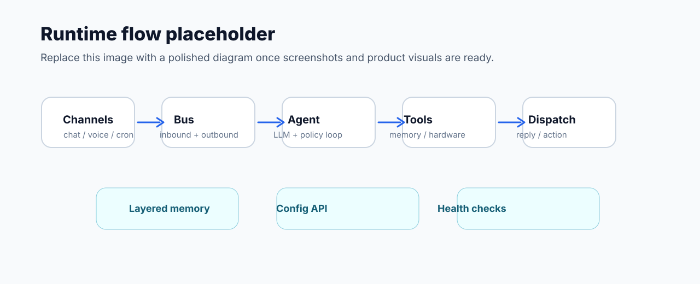

<div align="center">
  <a href="https://github.com/Openbeetles/beetles">
    
  </a>

  <h3><strong>边缘 Agent OS · 多通道接入 · 工具调用 · 分层记忆 · 硬件控制 · 运维诊断</strong></h3>

  <p>
    <a href="https://github.com/Openbeetles/beetles"></a>
    <a href="LICENSE-MIT"></a>
  </p>

  <p>
    <a href="https://github.com/Openbeetles/beetles">主页</a> |
    <a href="docs/README.md">文档</a> |
    <a href="#快速开始">快速开始</a> |
    <a href="#快速开始">从源码构建</a> |
    <a href="README.md">English</a>
  </p>
</div>

<p align="center">
  
</p>

**Beetles OS** 是面向 ESP32 和 Linux 边缘设备的 Agent Runtime。

它把聊天通道、大语言模型接入、工具调用、硬件控制、分层记忆和运维诊断整合到同一运行时。用户提交目标后，Agent 根据上下文选择工具、调用模型、执行硬件或系统动作，并通过通道返回结果。

当前已支持 ESP32-S3、ESP32-P4-NANO 和 Linux；P4-NANO 是双芯片板，WiFi 由板载协处理器提供。STM32、手机和更多边缘终端在规划中。

> 代码包名、命令、默认热点和部分路径目前仍沿用 `beetle` / `Beetle`，品牌展示统一使用 **Beetles OS**。

## 核心问题

传统 IoT 多以固定 App、按钮或接口驱动设备。Beetles OS 面向需要自然语言入口、工具调度和运维边界的边缘设备：

- 设备需要基于上下文处理目标，而不只是执行单次指令。
- 用户需要描述目标，不需要了解按钮、接口或引脚细节。
- 边缘设备资源有限，需要控制连接、内存、队列和 TLS 开销。
- 硬件操作需要权限边界，模型不应直接访问引脚、文件或凭据。
- 商用部署需要配置、诊断、恢复和升级能力。
- 不同项目会选择不同芯片和终端形态，需要复用同一套运行时。

Beetles OS 在同一 **Runtime** 中提供这些能力：

| 能力 | 处理方式 |
|------|----------|
| 自然语言入口 | 聊天通道接入后，Agent 汇总上下文、选择工具，并生成回复或动作 |
| 上下文处理 | 设备结合记忆、配置和现场状态执行任务 |
| 安全硬件访问 | 模型仅获得受控的设备能力、名称和说明，不直接访问引脚、文件或凭据 |
| 长期运行 | 入站/出站队列、通道分发、健康检查、诊断工具和恢复路径协同工作 |
| 资源治理 | ESP 侧跟踪内存、TLS、队列和运行压力，必要时降级或暂停高风险操作 |
| 配置与运维 | 提供本地配置页、HTTP API、状态检查、网络诊断、日志和 Linux 回滚路径 |
| 多平台复用 | 当前支持 ESP32-S3、ESP32-P4-NANO 和 Linux；P4-NANO 通过板载 WiFi 协处理器联网 |

## 适用场景

| 场景 | 典型用途 |
|------|--------------------|
| 桌面助理 | 聊天、提醒、任务、文档摘要、轻量工作流 |
| 前台设备 | 访客问答、信息展示、消息转发、值班提醒 |
| 提醒终端 | 周期提醒、语音播报、日程联动、通知投递 |
| 监控节点 | 读取传感器、判断阈值、发送告警 |
| 设备控制器 | GPIO、PWM、I2C、蜂鸣器、继电器等外设控制 |
| Linux 边缘节点 | 常驻服务、办公集成、长任务、部署回滚和更多本地工具 |

## 支持多种通信通道

<p align="center">
  
</p>

飞书、钉钉、企微和 QQ 频道可作为企业入口；Telegram 和 WebSocket 可作为可选能力接入 Bot 或自定义实时前端。更多 IM、Webhook、企业系统和私有通道可继续适配。

## 工业场景

工业现场需要可靠、安全、可运维的边缘设备。Beetles OS 适合部署在现有控制系统旁，作为边缘 Agent、交互层、诊断层和工具调用层。

它不替代 PLC、工控机或原有业务系统，而是为现有系统提供自然语言入口、受控工具调用和运维可见性。

| 需求 / 用例 | 支持方式 |
|-------------|----------|
| 设备告警 | 读取状态、判断异常、生成告警说明，并推送到飞书、钉钉、企微等通道 |
| 现场巡检 | 记录设备状态、巡检结果和历史问题，为后续处理保留上下文 |
| 远程维保 | 运维人员用自然语言查询状态、触发诊断、重启服务或执行安全工具 |
| 产线辅助 | 将 SOP、任务提醒、异常说明和现场反馈接入同一对话入口 |
| 环境监测 | 接入传感器，处理温湿度、烟雾、水位、能耗等监控和阈值告警 |
| 边缘网关 | 在 Linux 或 ESP 设备上连接本地硬件、模型服务、业务 API 和消息通道 |
| 安全控制 | 仅暴露允许的工具和设备能力，避免模型直接访问引脚、文件和凭据 |

## 记忆能力

Beetles OS 的记忆不只是保存聊天记录。它用于保存设备身份、接入设备、现场事件、任务进度和恢复点。

设备重启、切换通道或更换操作人员后，Agent 可以通过记忆恢复关键上下文。

| 记忆层 | 保存内容 | 用途 |
|--------|----------|------------|
| 会话摘要 | 最近对话、用户目标、未完成事项 | 在长对话中保留上下文，减少原文注入 |
| 长期记忆 | 偏好、画像、项目、任务、约束、事实 | 保存稳定信息，提升现场适配能力 |
| 事实记忆 | 带来源、置信度和新鲜度的关键事实 | 区分“确定事实”和“可能过期的信息” |
| 连续性记忆 | 当前进度、中断原因、下一步动作 | 支持任务中断、设备重启和远程接手后的恢复 |
| 证据归档 | 历史记录、引用、日志和观察结果 | 为解释、审计和排障提供依据 |
| 记忆诊断 | 稀疏、过期、冲突或待修复的记忆状态 | 让运维人员查看并修复记忆问题 |

记忆会按场景分范围：有些只属于当前会话，有些属于用户，有些是设备或外部世界事实。Beetles OS 还会给记忆标记置信度、新鲜度和复核提示，避免把过期状态当成确定结论。

## 支持大语言模型

Beetles OS 不绑定单一模型厂商。当前可配置 OpenAI、OpenAI-compatible、Anthropic、Gemini、GLM、通义千问、DeepSeek、Moonshot 和 Ollama 等模型服务。

<p align="center">
  
</p>

| 能力 | 说明 |
|------|------|
| 多模型服务商 | 支持 OpenAI、OpenAI-compatible、Anthropic、Gemini、GLM、通义千问、DeepSeek、Moonshot、Ollama 等 |
| 主备模型 | 可配置主模型和备用模型，提升可用性 |
| 边缘友好 | 模型在云端或本地服务中运行，设备侧负责上下文、工具、安全边界和执行 |
| 可配置 | API Key、Base URL、模型名、代理和搜索服务都可以在配置页设置 |

模型源不固化在固件中。API Key、模型名、Base URL、主用源和备用源都可以在本地配置页设置。

<p align="center">
  
</p>

## 运行时架构

<p align="center">
  
</p>

Beetles OS 不会将消息直接转发给大模型。消息进入系统后进入入站队列，再由 Agent 主循环处理：

```text
聊天通道 / 定时任务 / 语音输入
        -> 入站队列
        -> Agent Loop
        -> 大模型 + 工具 + 记忆
        -> 出站队列
        -> 聊天回复 / 硬件动作 / 系统任务
```

处理过程中，Runtime 会判断以下信息：

- **来源身份**：通道、会话、用户和允许范围。
- **上下文**：当前配置、会话摘要、稳定事实、历史证据和设备状态。
- **可用工具**：根据平台、功能开关、硬件配置和运行压力动态生成工具列表。
- **保护动作**：配置保存、远端发送、重启、恢复、硬件控制等操作需要明确边界。
- **输出目标**：聊天回复、提醒、任务、硬件动作或系统诊断结果。

因此，Beetles OS 的运行链路包括：**入口、上下文、决策、工具、记忆、执行、反馈、运维**。

## 工具与运维可见性

本地界面展示 Agent 可用工具、系统健康状态、模型调用和工具调用记录。商用部署可以基于这些信息检查状态、解释行为和定位故障。

<p align="center">
  
</p>

<p align="center">
  
</p>

聊天通道也可以触发状态查询。远程运维人员可获取平台、网络、资源压力和历史负载，再决定后续操作。

<p align="center">
  
</p>

## 主要能力

| 能力 | 说明 |
|------|------|
| 聊天入口 | 支持通过飞书、钉钉、企微、QQ 频道等通道与设备交互 |
| 模型接入 | 支持 OpenAI-compatible 和 Anthropic 接口，可配置主模型和备用模型 |
| 工具系统 | Agent 可以调用提醒、任务、日历、文件、网络、诊断、硬件等工具 |
| 分层记忆 | 历史证据、稳定事实和连续性数据分开保存，降低记忆混淆和错误引用 |
| 办公集成 | 启用对应能力后，可接入邮件、日历、联系人和文档空间 |
| 网页配置 | 首次启动后通过热点或局域网打开配置页，设置 WiFi、模型、通道和硬件 |
| 硬件控制 | 通过 `hardware.json` 将 LED、继电器、蜂鸣器、传感器等设备注册为受控能力 |
| 语音与显示 | 可选语音输入输出、SPI TFT 状态屏和运行时健康展示 |
| 诊断与运维 | 提供健康检查、网络检查、存储状态、重启、恢复和 Linux 服务回滚入口 |
| 资源治理 | 在 ESP 侧跟踪堆、TLS、队列和通道压力，控制边缘设备资源占用 |

## 硬件矩阵

Beetles OS 支持在不同硬件形态上运行同一套 Agent Runtime。

| 硬件 | 状态 | 能力 |
|------|------|------|
| ESP32-S3 | 已支持 | 小型硬件 Agent，支持记忆、对话和外设控制 |
| ESP32-P4-NANO | 已支持 | P4 运行 Beetles OS 主固件，板载 WiFi 协处理器负责联网 |
| Linux | 已支持 | 完整 Agent OS、长任务、本地工具和运维能力 |
| STM32 | 规划中，尚未支持 | 面向工业控制和低功耗设备 |
| 手机 | 规划中，尚未支持 | 面向移动 Agent 和现场运维 |
| 更多终端 | 规划中，尚未支持 | 网关、屏幕、边缘盒子等商用设备 |

当前板型预设：

| BOARD | Flash | PSRAM | 说明 |
|-------|-------|-------|------|
| `esp32-s3-8mb` | 8MB | 8MB | N8R8 |
| `esp32-s3-16mb` | 16MB | 8MB | 常用默认选择 |
| `esp32-s3-32mb` | 32MB | 16MB | N32R16 |
| `esp32-p4-nano-16mb` | 16MB | 32MB | Beetles OS 运行在 P4；板载 WiFi 协处理器负责联网 |

硬件控制场景优先选择 ESP32-S3 或 ESP32-P4。

模型能力、办公集成、长任务和部署便利性优先选择 Linux。

## 快速开始

### 1. 准备工具链

- 安装 [esp-rs 工具链](https://docs.espressif.com/projects/rust-book/en/latest/introduction.html)：`espup install`
- 安装烧录工具：`cargo install espflash`
- Windows 需要安装 Visual Studio，并勾选 Desktop development for C++

### 2. 编译或烧录

macOS / Linux：

```bash
./build.sh
./build.sh --flash
BOARD=esp32-s3-16mb ./build.sh --flash
BOARD=esp32-p4-nano-16mb ./build.sh --flash
```

Windows：

```powershell
.\build.ps1
.\build.ps1 --flash
$env:BOARD="esp32-s3-16mb"; .\build.ps1 --flash
$env:BOARD="esp32-p4-nano-16mb"; .\build.ps1 --flash
```

不设置 `BOARD` 或 `--target` 时，构建脚本会尝试通过 `espflash board-info` 自动识别唯一连接的开发板。识别不到、识别结果不受支持，或同时连接了多个串口时，请手动设置 `BOARD`。

ESP32-P4-NANO 是双芯片板，完整烧录通常需要依次烧录 WiFi 协处理器固件和 P4 主固件：

```bash
./build.sh flash-c6
BOARD=esp32-p4-nano-16mb ./build.sh --flash
./build.sh flash-all
```

烧录板载 WiFi 协处理器前，先让 P4 进入 bootloader 模式，避免共享板级连线互相干扰。

### 3. 打开配置页

首次启动后，ESP 设备会开启名为 **Beetle** 的热点。

1. 手机或电脑连接热点 **Beetle**。
2. 浏览器打开 **http://192.168.4.1**。
3. 设置配对码。
4. 配置 WiFi、大模型和要使用的聊天通道。

设备连接路由器后，可通过局域网 IP 打开配置页。Linux 版本如果启动时已有可用网络，会优先继承当前系统网络；此时请访问设备当前 LAN IP。

## 配置界面

<p align="center">
  
</p>

首次连接时，配置页用于完成设备地址和配对码设置。完成后，配置页作为设备本地控制台，可查看连接状态、设备信息和通道连通性，也可配置模型、通道、工具、日志和系统参数。

<p align="center">
  
</p>

<p align="center">
  
</p>

配置页覆盖常用设置：

| 配置区 | 作用 |
|--------|------|
| WiFi | 路由器 SSID 和密码 |
| LLM | 服务商、模型、API Key、API URL、备用模型 |
| Channels | 飞书、钉钉、企微、QQ 频道等通道凭据 |
| Proxy / Search | 代理和搜索服务配置 |
| Hardware | 用 `hardware.json` 定义可被 Agent 控制的外设 |
| Display | SPI TFT 状态屏 |
| System | 健康检查、重启、恢复、OTA（启用时） |

自定义前端、脚本或集成程序可参考 [配置 API](docs/zh-cn/config-api.md)。

## 仓库结构

| 路径 | 说明 |
|------|------|
| `src/` | Beetles OS 核心运行时、Agent Loop、通道、工具、记忆、平台抽象 |
| `configure-ui/` | Web 配置前端，也可以打包成桌面壳 |
| `docs/` | 用户文档、集成文档、开发文档 |
| `components/` | ESP-IDF 侧组件与底层封装 |
| `scripts/` | 构建、烧录、检查和辅助脚本 |
| `storage_data/` | ESP 侧默认存储数据 |
| `packaging/` | Linux 发布包相关内容 |
| `tests/` | 运行时、工具、记忆和 Agent 行为测试 |

## 后续阅读

| 你的目标 | 文档 |
|----------|------|
| 第一次配置设备 | [配置指南](docs/zh-cn/configuration.md) |
| 查看 Agent 可用工具 | [工具列表](docs/zh-cn/tools.md) |
| 配置大模型服务商 | [LLM Providers](docs/zh-cn/llm-providers.md) |
| 配置硬件外设 | [硬件设备配置](docs/zh-cn/hardware-device-config.md) |
| 查看支持板型和硬件问题 | [硬件说明](docs/zh-cn/hardware.md) |
| 调用 HTTP API | [配置 API](docs/zh-cn/config-api.md) |
| 部署 Linux 版本 | [Linux 安装、发布与回滚](docs/zh-cn/linux-release-rollback.md) |
| 了解模块边界 | [架构说明](docs/zh-cn/architecture.md) |
| 浏览完整文档地图 | [docs/README.md](docs/README.md) |

## 关于我们

Beetles OS 由 **Openbeetles** 发起。我们希望把大语言模型、边缘硬件和真实世界的设备控制连接起来，让开发者更容易做出可靠、安全、可运维的商用智能硬件。

这个项目仍在快速演进。我们欢迎对边缘 Agent、硬件控制、Linux 部署、模型接入和设备运维感兴趣的开发者一起参与。

## 常见问题

- 烧录失败：检查 USB 线、串口和 `ESPFLASH_PORT`。
- `flash-c6` 失败：检查 WiFi 协处理器串口 `ESP_HOSTED_C6_PORT`，并让 P4 进入 bootloader 模式。
- 配置页打不开：重新连接热点 **Beetle**，再打开 `http://192.168.4.1`；Linux 版本请确认当前 LAN IP。
- `storage partition could not be found`：通常由板型预设或分区表不匹配导致。
- 通道无消息：检查模型配置、通道凭据和 allowed chat ids。
- 硬件工具没有出现：检查 `hardware.json`，确认对应设备能力已经注册。

## 许可

Beetles OS 使用 **MIT OR Apache-2.0** 双许可证。详见 [LICENSE-MIT](LICENSE-MIT) 和 [LICENSE-APACHE](LICENSE-APACHE)。
