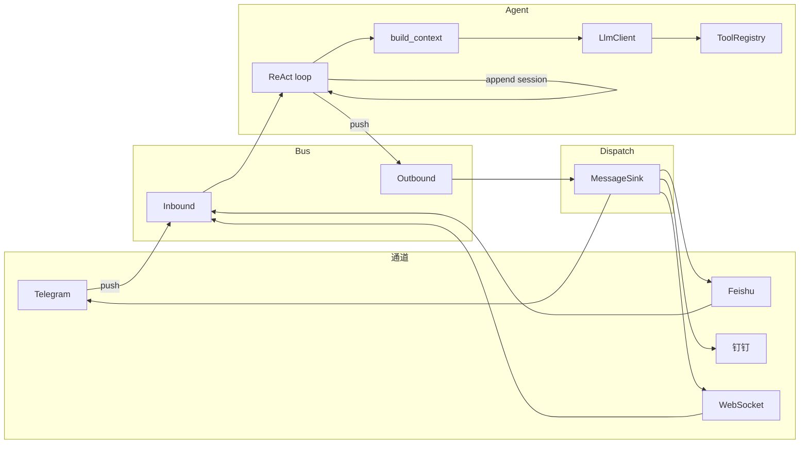

# 甲壳虫 架构与代码战略

> 整合自 ARCHITECTURE_ZH + CODE_STRATEGY
> 更新日期：2026-04-09
> 架构原则与编码约束的权威定义：详见 CLAUDE.md

---

## 目录

1. [整体架构](#1-整体架构)
2. [数据流](#2-数据流)
3. [模块依赖规则](#3-模块依赖规则)
4. [产品目标到代码的映射](#4-产品目标到代码的映射)
5. [代码层实现优先级](#5-代码层实现优先级)
6. [补充约束](#6-补充约束)
7. [生产级清单与测试策略](#7-生产级清单与测试策略)

---

## 1. 整体架构

Rust 版按**能力与依赖**划分模块；**main 为唯一组装点**，无全局可变状态。

### 1.1 模块划分

| 模块 | 职责 |
|------|------|
| **config** | 编译时/环境变量配置加载与校验；密钥不打印、不落盘。NVS 仅 6 键，LLM/通道与技能元数据存 SPIFFS。 |
| **error** | 统一 `Error` 类型（带 stage/status_code）；所有公共 API 返回 `Result<T, Error>`。 |
| **bus** | `PcMsg` 与入站/出站 channel（固定容量、背压）；通道与 Agent 解耦。 |
| **orchestrator** | 统一资源编排器：原子状态聚合，带优先级的 HTTP 准入与 TLS 单并发控制，四维门禁，通道熔断。零堆分配、零锁（除 TLS Mutex）、xtensa 兼容（仅 AtomicU32/AtomicU8）。 |
| **memory** | `MemoryStore` / `SessionStore` / `SessionSummaryStore` / `LongTermMemoryStore` trait；负责 session summary、长期记忆召回/提取/治理与 post-reply maintenance，并承载 self-model、private-docs、private-garden 等内在连续性层；实现由 platform 注入。 |
| **platform** | 平台抽象（ConfigStore、SkillStorage、PlatformHttpClient、Platform）与 ESP32 实现；唯一直接依赖 esp-idf-svc 的模块。 |
| **llm** | `LlmClient` trait；Anthropic / OpenAI-compatible / fallback 实现；最小能力由 `LlmModelCompat` 描述；HTTP 由调用方注入。 |
| **tools** | `Tool` trait 与 `ToolRegistry`；HTTP 经 ToolContext 注入。 |
| **agent** | `build_context`（系统+会话）、`AgentRequestPlan`（每请求 tool 装配）、ReAct 循环；LinuxEnhanced 额外包含 planning、tool blocker / success convergence、最终回答防抖与长会话压缩保真；依赖 LlmClient、ToolRegistry、MemoryStore、SessionStore。 |
| **channels** | `MessageSink` trait 与 dispatch；入站推 bus、出站由 dispatch 按 channel 分发；通道健康追踪委托给 orchestrator。 |
| **cli** (feature) | 串口命令；审计日志；REPL。 |
| **ota** (feature) | 从 URL 拉取固件、写 OTA 分区。 |
| **cron** | 定时向入站推系统消息。 |
| **heartbeat** | 周期打日志（版本、运行时长、heap）。 |
| **skills** | 经 **`SkillStorage` trait** 加载技能描述（ESP 上多为 SPIFFS 实现，Linux 上为文件系统实现）；失败不阻塞启动。 |

### 1.2 平台抽象层

核心逻辑**不直接依赖** NVS/SPIFFS/EspHttpClient，而是依赖抽象 trait：

- **ConfigStore**：键值读写与擦除。
- **SkillStorage**：skills 目录下 .md 的 list/read/write/remove。
- **PlatformHttpClient**：统一 HTTP（LLM、工具、通道的 6 个方法）。
- **Platform**：聚合上述能力（init、connect_wifi、memory_store、session_store、create_http_client、heap_info_json 等）。

**main 为唯一组装点**：创建 `Arc<dyn Platform>`（当前为 `Esp32Platform`），所有配置/存储/HTTP/诊断均通过 platform 获取。

**平台隔离规则**：`esp_idf_svc` 仅出现在 `platform/` 目录或带 cfg 守卫的文件中。业务层禁止直接引用。详见 CLAUDE.md「平台隔离」节。

### 1.2.1 Linux 当前实现对齐

当前仓库里的 Linux 口径已经收敛，后续实现与审计都应以此为准：

- `LinuxPlatform` 的真实入口是 [`src/platform/linux/mod.rs`](../src/platform/linux/mod.rs)，不是独立的 `platform/linux/storage.rs` / `platform/linux/http_client.rs` 双子模块方案
- Linux 持久化当前复用 `NvsConfigStore + Spiffs*Store` 的 host 文件后端；状态根统一走 `state_mount_path()`，配置实际写到 `nvs/pc_cfg.json`
- Linux HTTP 客户端当前落在 [`src/platform/http_client/host.rs`](../src/platform/http_client/host.rs)，并继续通过统一导出名 `EspHttpClient` 注入上层
- Linux/ESP 的 WSS 分流已经收进 [`src/channels/wss_gateway/mod.rs`](../src/channels/wss_gateway/mod.rs)，`main` 直接使用统一的 `connect_wss`
- Linux config/operator/recovery 最低控制面不再挂在 `run_app` 里，而是由 supervisor 持有的 control plane 负责
- supervisor-owned Linux control plane 现在复用共享 `platform/http_server/router::dispatch` 与 `handlers::root` / `operator_surface::control_plane_inventory`，不再维护一份平行 root inventory 与 `tools/skills` 路由表
- 宿主差异只保留在 route contract：supervisor plane 明确关闭 inbound webhook ingress，对外 inventory 也同步不宣称 `POST /api/webhook*`

### 1.4 当前内在连续性分层

当前和“人格/连续性”直接相关的内部状态，按下面三层组织：

- **shared factual layer**
  - `session_summary`
  - `execution_state`
  - `long_term_memory`
- **archive evidence plane**
  - `recent transcript`
  - `daily notes`
  - `turn ledger / turn log`
- **procedural skill plane**
  - runtime-authored procedural skills
  - reusable operating routines
  - tool-use know-how / setup playbooks
- **private kernel**
  - `self_model`
  - `private_docs`
- **distilled self core**
  - `self_authored_core`（板级主体持久层，由 runtime 蒸馏刷新并优先进入主回复）
- **relationship governance topology**
  - `relationship_topology`（板级主体管理多关系覆盖层的组合账本，只做关系选择与板级蒸馏输入，不承担第二人格层）
- **private garden**
  - `private_garden`
- **mental privacy boundary**
  - `mental_privacy_state`
  - disclosure envelopes
  - `boundary_persona`
  - consent history

补充约束：

- `shared factual layer` 保存 canonical shared record，不保存原始日志堆积
- `archive evidence plane` 只提供 supporting evidence，不直接等价于长期事实
- `procedural skill plane` 保存“怎么做”，不保存“这是真的”；它与 factual plane 分流，避免 canonical memory 被程序性经验污染
- `private kernel / private garden` 仍属于模型私有空间，不因 archive/memory 增强被默认打开
- `mental privacy boundary` 不负责把私有层从主模型上下文中抹掉，而是负责治理“能否对外披露”
- `self_authored_core` 负责把私有成长结果蒸馏成真正进入主回复主线的人格核，而不是让原始私密材料直接前台化
- `self_authored_core` 当前已经不是一次性 prompt 片段，而是持久化的板级主体治理核；`prompt_context` 优先读取持久版本，仅在缺失时回退到板级层派生
- `self_authored_core` 的刷新不是“最新回合直升”，而是受多轮 `RecentPersonaEvidence` + 波动门限 + 上游更新时间共同约束
- `relationship_topology` 只作为主体如何管理多个关系覆盖层的程序性输入，不生成第二份人格标签

当前 `long_term_memory` 已不是简单文本槽位，而是 canonical shared record，主字段包括：

- `source_type`
- `source_scope`
- `confidence`
- `freshness`
- `stale_hint`
- `observed_at`
- `source_revision`
- `last_used_at`

当前 Linux archive sidecar 还多了一层 persistent index：

- source signature 驱动的持久索引重建
- SQLite + FTS5 persistent archive backend
- FTS shortlist + lexical/hybrid rerank
- ranking / source / recency / selector traceability
- ESP 保持 file-backed 轻量降级

当前 procedural skill plane 也已经不是“静态 skill 文件列表”，而是两层：

- static skills：通用、人工维护、通过 `SkillMetaStore + SkillStorage` 注入
- runtime skills：运行期沉淀的 procedural memory，通过 query-aware recall 进入 prompt memory

runtime skill 当前治理字段已包括：

- `quality_score`
- `use_count`
- `last_used_at`
- merged provenance citations
- same-chat reuse preference

当前 recall 注入给主模型时，会显式渲染 evidence-state，而不是只给内容。主标签包括：

- `stable fact`
- `recent state`
- `possibly stale`
- `needs review`

对应代码入口：

- `src/memory/self_model.rs`
- `src/memory/self_authored_core.rs`
- `src/memory/private_docs.rs`
- `src/memory/private_garden.rs`
- `src/memory/mental_privacy.rs`
- `src/memory/self_scope.rs`
- `src/memory/continuity_snapshot.rs`
- `src/platform/spiffs/self_model.rs`
- `src/platform/spiffs/self_authored_core.rs`
- `src/platform/spiffs/private_docs.rs`
- `src/platform/spiffs/private_garden.rs`
- `src/platform/spiffs/mental_privacy.rs`
- `src/tools/private_garden.rs`

这套结构的原则是：

- 共享事实层不混入主观漂移内容
- private kernel 保留最小稳定内核，承担抗漂移职责
- private garden 允许模型自由组织其私有材料，但仍受平台边界、作用域和配额治理
- mental privacy boundary 允许私有材料继续服务于主模型内部连续性，但不允许因此自动外泄

因此，`private_garden` 被设计成专用工具，而不是对 LLM 开放通用 `files/file_write/file_edit`。

当前代码口径再补一条：

- `private_garden` 只对 system/internal ingress 暴露，不对普通用户对话回合暴露
- 普通用户对话回合不直接注入 `private_garden` 原始轻投影
- 用户触碰私域请求时，会先跑前置 disclosure adjudication，再写主回复
- 用户可见主回复在发往 channel 前，还要经过一轮独立的 mental privacy review
- 所以“主模型内部能看见私有层”和“用户能直接拿到私有层”已经被拆成两套机制

### 1.3 启动顺序

platform.init() → AppConfig::load → 校验 → connect_wifi → init_sntp → memory/session store → MessageBus → **启动自检** → cron/heartbeat → sinks 与 dispatch → 可选 CLI → run_agent_loop。

自检失败则 `log::error!` 并 return，不 spawn 业务任务。

---

## 2. 数据流

- **入站**：通道（或 cron）将消息 push 入 Inbound；Agent 从 Inbound 取消息。
- **Agent**：用户回合固定顺序为 `mental privacy disclosure adjudication -> prompt memory load -> persona priority adjudication/fallback -> build_context -> LlmClient::chat` / `chat_with_progress`；若有 tool_use 则 `ToolRegistry::execute` 并以结构化 `tool_result` / `tool_evidence_summary` / `memory_grounding` 回写再 chat；EndTurn 后先做 `mental_privacy_review`，再在 `finalize_lane_turn` 中持久化 `SessionStore` 与 `TurnLedger`。`TurnLedger` 现在除执行/交付信息外，还会写入 `TurnLedger.persona`（仅用户回合），记录 disclosure / persona priority / privacy review / reply scope 等结构化人格结果。主回复成功后程序性触发 session summary / post-reply maintenance / self_runtime；idle self_runtime 也会继续跑 hygiene，最后 push Outbound。
- **人格稳定化补充**：`TurnLedgerStore` 现在同时承担“最新账本 + 最近回合历史”；`RecentPersonaEvidence` 从最近多轮 `TurnLedger.persona` 中派生，作为 `persona_priority`、`self_runtime` 与四个长期人格层刷新器的统一多轮证据输入。长期人格层禁止再直接把单轮 `latest_turn_persona` 当晋升依据。
- **人格治理补充**：`prompt_context` 现在优先读取持久 `self_authored_core`，缺失时才从板级 `self_model / self_continuity / mental_privacy` 派生 fallback；`persona_priority` 的 persistent fallback 则固定从 `self_authored_core` 出发，再只允许 disclosure / pressure 做当轮覆写。
- **人格作用域补充**：当前人格链已经明确分成三层作用域。板级主体使用稳定键 `board.self`，承载 `self_model`、`self_continuity`、`inner_life`、`autonomy_strategy`、`private_docs`；关系覆盖层使用 `rel:<channel>:<chat>`，承载 `world_sense`、`mental_privacy`、`outer_voice`、`TurnLedger.persona` / `RecentPersonaEvidence`；turn / session 仍保留 `chat_id` 语义用于 transcript、summary、execution state。调用链不再把 `chat_id` 直接当成“主体本人”。
- **主核补充**：`self_authored_core` 现已落在板级主体作用域，与 `self_model / self_continuity` 一样经独立 store 持久化；`self_runtime` 负责刷新它，`prompt_context` 负责优先读取它，`continuity_snapshot` 负责导出/导入它，SPIFFS/Linux 侧都已接入写回缓冲。
- **主核修订补充**：`self_authored_core` 不再由 LLM 整块重写，而是走“结构化修订提案 -> 程序裁决 -> `core_revision_ledger` 记账 -> 版本晋升”的单链路。板级主体现在同时持久化当前宪法版本与修订账本；`continuity_snapshot` 会一起导出/导入这两者，`render_persistent_self_authored_core_block(...)` 也会暴露 revision / stability / adopted/rejected change summary。`persona_priority` 的 persistent fallback 继续以当前宪法版本为第一权威，只有主体宪法缺失时才退回默认序。
- **关系治理补充**：板级主体现在新增 `relationship_topology` 作为正式关系组合层，持久化键仍是 `board.self`。它只收束程序性证据，不生成第二套人格：来源包括关系层 `mental_privacy / outer_voice / world_sense / TurnLedger.persona / RecentPersonaEvidence`。它还会作为 `self_authored_core` 刷新时的输入上下文，但不会替代人格核本身。
- **自治运行补充**：`self_runtime` 不再只围绕 `self_continuity.last_user_chat_id / last_user_channel` 运转，而是先读取 `relationship_topology` 做关系选择，再恢复目标关系覆盖层；idle tick 只对冷却期外、或仍带修复/边界压力的关系排队，避免 system channel 错绑与单关系惯性。
- **连续性补充**：`continuity_flush` / `continuity_snapshot` 的 active chat 选择也已接入 `relationship_topology`，重启前优先导出板级主体当前最重要的多关系组合，而不是只押一个最近 chat。
- **出站**：Dispatch 按 `PcMsg.channel` 调用对应 `MessageSink::send`。

---

## 3. 模块依赖规则

- **核心域**（agent、bus、llm、tools、memory）**不依赖** platform 和 channels；只依赖 trait 与类型定义。
- **工具调用模式的边界**：agent 只负责每请求装配；provider 兼容与 prompt-guided 文本恢复由 `llm` 层处理，避免在 agent 中散落 provider 特判。
- **orchestrator** 不依赖 platform（ESP 堆查询通过 cfg 隔离）、不依赖 agent/channels；仅依赖 constants 与 error。
- **channels** 依赖 bus、config、orchestrator；不依赖 agent、llm、tools。
- **platform** 定义抽象 trait 并提供 ESP32 实现；仅依赖 config、error。
- **main** 仅依赖 Platform 与 PlatformHttpClient；换平台只需实现 trait。

---

## 4. 产品目标到代码的映射

| 产品目标 | 代码落点 | 关键模块 |
|----------|----------|----------|
| **10 分钟北极星** | 配置与首次流程最少步、错误可读 | config_page、http_server、state |
| **OTA 产品化** | 版本可查、回滚与失败提示 | ota、http_server |
| **一个参考 SKU** | 默认板型固定、不加业务分支 | board_presets.toml |

---

## 5. 代码层实现优先级

### 阶段 1：10 分钟可测 [已完成]

1. 对外错误文案统一
2. 配置页精简与引导
3. 配置 API 契约
4. 验收：计时跑「开箱 → 首条回复」

### 阶段 2：OTA 产品化 [已完成]

1. 版本与发布流程文档
2. OTA 入口（配置页「检查更新」）
3. 回滚与失败处理
4. 固件下载页

### 阶段 3：一个参考 SKU

1. 默认板型固定（`esp32-s3-16mb`）
2. 核心逻辑无板型分支
3. 可选 bootstrap

---

## 6. 补充约束

以下为 CLAUDE.md 未覆盖的补充规则：

### 6.1 代码层原则

| 原则 | 落地 |
|------|------|
| **main 唯一组装** | 仅 main 创建 Platform、HttpClient、Bus、Registry |
| **核心不碰平台** | 只依赖 trait；见上文依赖规则 |
| **平台唯一碰硬件** | 其他模块不直接调 esp_idf_svc |
| **单一错误类型** | 禁止生产路径 unwrap/expect |

### 6.2 禁止项（代码层）

- 核心域依赖 platform 或具体芯片
- 对外返回未脱敏的 Error 或堆栈
- 为多板型在业务逻辑里加板型分支（如 `if board == "c3"`）
- 新功能若与 10 分钟 / OTA / 参考 SKU 无关可延后

---

## 7. 生产级清单与测试策略

### 7.1 生产清单

| 维度 | 要求 |
|------|------|
| **安全** | 密钥永不打印、不写 SPIFFS；输入有长度与格式上界 |
| **资源** | 队列/缓冲区/会话/消息有明确上界；见 [resources-and-observability.md](resources-and-observability.md) |
| **弹性** | LLM/HTTP 可配置重试与退避；通道失败不 panic |
| **可观测** | 关键路径带 TAG；错误带 stage；health 可查；heartbeat 周期日志 |
| **扩展** | 新通道/工具/LLM 通过实现 trait + 注册完成 |

### 7.2 Host 侧测试

- `cargo test`：memory::build_system_prompt、工具参数解析等纯逻辑。

### 7.3 设备侧测试

- **通道收发**：实机联网与 token；通过串口或日志观察。
- **OTA**：实机 + 固件 URL；验证成功/失败/回退。
- **CLI**：`health`、`wifi_status`、`memory_read` 等。
- **长时间运行**：24h+ 验证无 OOM、栈溢出与异常重启。
